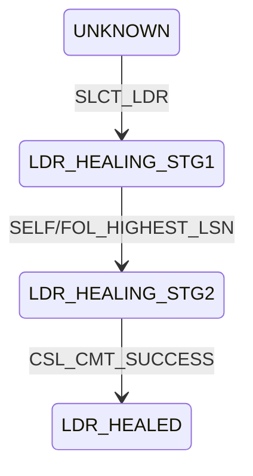
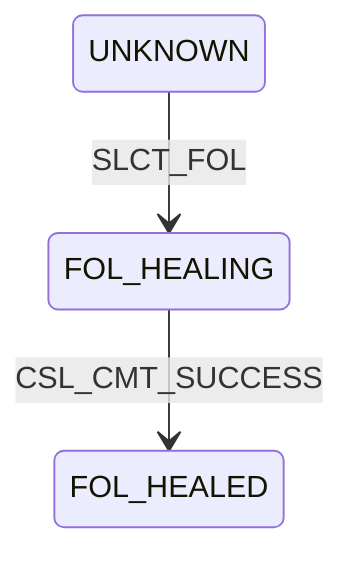
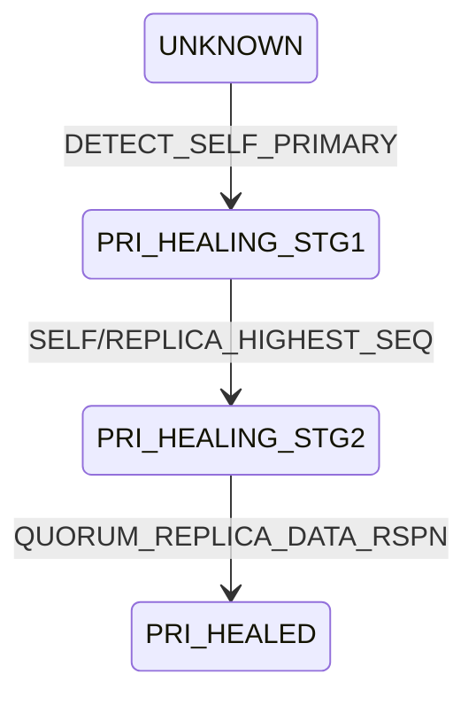
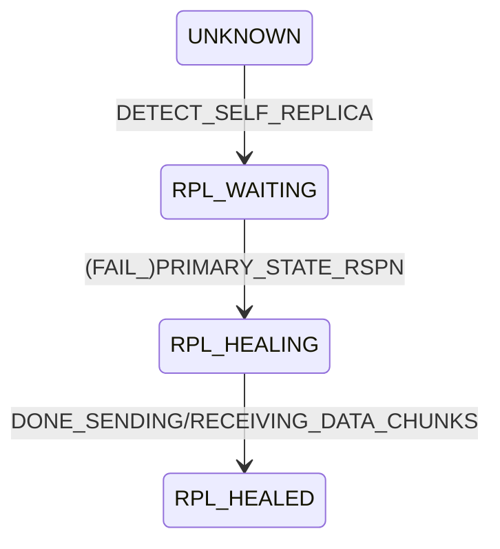

# Recovery Finite State Machines
{: .no_toc }

* toc
{:toc}

## Introduction

When a BlazingMQ cluster experiences a node start/stop, a leadership change, or
a network partition, the cluster must heal itself before it can resume serving
traffic.  BlazingMQ uses two cooperating finite state machines (FSMs) to
orchestrate this recovery:

- **Cluster FSM** -- Manages cluster-wide consensus.  It responds to leader
  elections, heals the Cluster State Ledger (CSL), assigns partition
  primaries and queues.  There is one Cluster FSM per node.

- **Partition FSM** -- Manages per-partition storage recovery.  It synchronizes
  storage files between the primary and its replicas so that a quorum of nodes
  hold consistent storage.  There is one Partition FSM per partition, each
  running on its own dispatcher thread.

The two FSMs form a pipeline: the Cluster FSM heals the cluster-level state
first, then dispatches detection events (`e_DETECT_SELF_PRIMARY`,
`e_DETECT_SELF_REPLICA`) to each Partition FSM to kick off storage-level
healing.

Readers should be familiar with [Clustering](../clustering) and
[High Availability](../high_availability) before reading this article.

---

## Cluster FSM

### Purpose

After the [elector](../election_rsm) selects a new leader, every node in the
cluster must agree on the contents of the Cluster State Ledger -- a replicated
log that records the cluster state -- consisting of partition primary
assignments and queue/appId assignments.  The Cluster FSM drives this agreement
process.

The implementation lives in three source files:

- [`mqbc_clusterstatetable.h`](https://github.com/bloomberg/blazingmq/blob/main/src/groups/mqb/mqbc/mqbc_clusterstatetable.h) -- the state-transition table
- [`mqbc_clusterfsm.h/.cpp`](https://github.com/bloomberg/blazingmq/blob/main/src/groups/mqb/mqbc/mqbc_clusterfsm.h) -- the FSM execution mechanism containing an internal event queue
- [`mqbc_clusterstatemanager.h/.cpp`](https://github.com/bloomberg/blazingmq/blob/main/src/groups/mqb/mqbc/mqbc_clusterstatemanager.h) -- implementation of the FSM actions

### States

| State | Enum | Description |
|---|---|---|
| **UNKNOWN** | `e_UNKNOWN` | Leader is unknown; waiting for election result |
| **FOL_HEALING** | `e_FOL_HEALING` | Follower is healing its CSL |
| **LDR_HEALING_STG1** | `e_LDR_HEALING_STG1` | Leader is collecting follower LSNs to find the most up-to-date CSL |
| **LDR_HEALING_STG2** | `e_LDR_HEALING_STG2` | Leader is applying the up-to-date CSL and committing a LeaderAdvisory |
| **FOL_HEALED** | `e_FOL_HEALED` | Follower CSL is healed and in sync |
| **LDR_HEALED** | `e_LDR_HEALED` | Leader CSL is healed and in sync |
| **STOPPED** | `e_STOPPED` | Node is shutting down |

### Happy-Path Flows

#### Leader Healing

When the elector picks this node as leader, the `ClusterStateManager` fires
`e_SLCT_LDR`.  The FSM transitions through three phases:

1. **UNKNOWN -> LDR_HEALING_STG1.**  The leader starts a watchdog timer,
   records its own LSN (Leader Sequence Number), and sends `FollowerLSNRequest`
   to all peers.

2. **LDR_HEALING_STG1 (collecting LSNs).**  As followers reply with their LSNs,
   each response is stored and quorum is checked.  A follower communicates its
   LSN in one of two ways:
   1. Follower replies to the `FollowerLSNRequest` with its LSN.
   2. In case follower starts up late and missed the `FollowerLSNRequest`, it
      also proactively sends a  `RegistrationRequest` with its LSN to the
      leader.
   Once a quorum of LSNs has been gathered, the leader determines which node
   has the highest LSN:
   - If the leader itself has the highest LSN, it transitions to STG2 and
     applies its own CSL.
   - If a follower has the highest LSN, it transitions to STG2 and requests
     that follower's CSL snapshot via `FollowerClusterStateRequest`.

3. **LDR_HEALING_STG2 -> LDR_HEALED.**  After the CSL is applied (either from
   self or from the follower's snapshot), the leader commits a LeaderAdvisory.
   When the commit succeeds, the FSM stops the watchdog, and notifies the
   Partition FSMs of the newest partition assignments.



#### Follower Healing

Follower healing is simpler because the follower delegates most of the work to
the leader:

1. **UNKNOWN -> FOL_HEALING.**  The follower starts a watchdog and sends a
   `RegistrationRequest` (carrying its LSN) to the leader.

2. **FOL_HEALING.**  While healing, the follower cooperates with the leader's
   protocol -- responding to `FollowerLSNRequest` and
   `FollowerClusterStateRequest` messages as needed.

3. **FOL_HEALING -> FOL_HEALED.**  The follower does not wait for an explicit
   registration response.  Instead, it waits for the leader's LeaderAdvisory
   commit to propagate through the replicated CSL.  When the local CSL commits
   successfully, the follower transitions to `FOL_HEALED`, stops its watchdog,
   and notifies the Partition FSMs.



### Steady State

Once healed, both leader and follower handle ongoing changes as self-loops
without leaving the healed state:

- **Leader** handles late-joining followers via `RegistrationRequest`: it sends
  a response and applies a new LeaderAdvisory.
- **Follower** receives advisory commits and notifies its Partition FSMs.
- Both handle `RST_PRIMARY` (loss of a partition primary) by forwarding it to
  the Partition FSMs.

### Error Recovery

The Cluster FSM uses several mechanisms to handle failures during healing:

- **Watchdog timeout.**  A node starts a watchdog timer when it begins healing,
  i.e. during `UNKNOWN -> LDR_HEALING_STG1` or `UNKNOWN -> FOL_HEALING`.  If
  the node is not healed after the configured time, the watchdog fires and
  reapplies the original election event, retrying healing from scratch.  After
  exhausting a configured number of retries, the broker terminates.

- **CSL commit failure.**  If the commit fails during healing, the FSM
  triggers the watchdog to fire immediately, which restarts healing through
  the watchdog timeout path.  A commit that arrives in a state where none
  should be in flight (`UNKNOWN` or `LDR_HEALING_STG1`) is treated as a fatal
  error and aborts the broker.

- **Role change mid-healing.**  If the elector changes the node's role while
  healing is in progress, the FSM transitions to UNKNOWN with cleanup and
  re-enqueues the new role's election event, starting fresh in the new role.

- **Quorum loss in STG2.**  If enough followers disconnect during STG2 to
  break quorum, the FSM regresses to `LDR_HEALING_STG1` to re-collect LSNs
  from the remaining nodes.

---

## Partition FSM

### Purpose

After the Cluster FSM assigns primaries, each partition must synchronize its
storage files across the primary and replicas.  The Partition FSM orchestrates
this data-level recovery: the primary figures out which node has the most
up-to-date data, pulls or pushes storage records as needed, and waits for a
quorum of replicas to confirm synchronization before serving traffic.

The implementation lives in:

- [`mqbc_partitionstatetable.h`](https://github.com/bloomberg/blazingmq/blob/main/src/groups/mqb/mqbc/mqbc_partitionstatetable.h) -- the state-transition table
- [`mqbc_partitionfsm.h/.cpp`](https://github.com/bloomberg/blazingmq/blob/main/src/groups/mqb/mqbc/mqbc_partitionfsm.h) -- the FSM execution mechanism containing an internal event queue
- [`mqbc_storagemanager.h/.cpp`](https://github.com/bloomberg/blazingmq/blob/main/src/groups/mqb/mqbc/mqbc_storagemanager.h) -- implementation of the FSM actions

### States

| State | Enum | Description |
|---|---|---|
| **UNKNOWN** | `e_UNKNOWN` | Primary is unknown |
| **PRI_HEALING_STG1** | `e_PRIMARY_HEALING_STG1` | Primary is collecting replica sequence numbers to determine the most up-to-date node |
| **PRI_HEALING_STG2** | `e_PRIMARY_HEALING_STG2` | Primary is synchronizing data with replicas |
| **PRI_HEALED** | `e_PRIMARY_HEALED` | Primary is active; quorum of replicas is in sync |
| **RPL_WAITING** | `e_REPLICA_WAITING` | Replica must wait for either success or failure `PrimaryStateResponse` |
| **RPL_HEALING** | `e_REPLICA_HEALING` | Replica is following instructions from primary to synchronize its storage data |
| **RPL_HEALED** | `e_REPLICA_HEALED` | Replica storage is synchronized with primary |
| **STOPPED** | `e_STOPPED` | Node is stopping |

### Happy-Path Flows

#### Primary Healing

When the Cluster FSM dispatches `e_DETECT_SELF_PRIMARY`, the Partition FSM
transitions through three phases:

1. **UNKNOWN -> PRI_HEALING_STG1.**  The primary starts a watchdog, opens
   recovery file set, records its own partition sequence number, and sends
   `ReplicaStateRequest` to all replicas.

2. **PRI_HEALING_STG1.**  As replicas respond, their sequence numbers are
    stored and quorum is checked.  A replica communicates its sequence number
    in one of two ways:
   1. Replica replies to the `ReplicaStateRequest` with its sequence number.
   2. In case a replica starts up late and missed the `ReplicaStateRequest`,
      it also proactively sends a `PrimaryStateRequest` with its sequence
      number to the primary.
   Once a quorum of sequence numbers has been gathered, the primary
   determines which node has the highest sequence number:
   - If the primary itself has the highest sequence number, it transitions
     to STG2, closes the recovery file set, and opens its own storage.
   - If a replica has the highest sequence number, it transitions to STG2
     and requests that replica's data via `ReplicaDataRequestPull`.

3. **PRI_HEALING_STG2.**  The direction of data flow depends on
   who has the most up-to-date data:
   - **Primary has highest sequence:** the primary opens its storage, sends
     `ReplicaDataRequestPush` to behind replicas (and `ReplicaDataRequestDrop`
     to those with extraneous data), and starts streaming data chunks.
   - **A replica has highest sequence:** the primary sends
     `ReplicaDataRequestPull` to that replica, receives data chunks, then
     pushes to all other replicas.

   As replicas confirm synchronization via `ReplicaDataResponsePush`, the
   primary counts responses.  When a quorum is reached, the FSM transitions to
   `PRI_HEALED` and marks the partition active.



#### Replica Healing

1. **UNKNOWN -> RPL_WAITING.**  The replica starts a watchdog, opens recovery
   files, records its own sequence number, and sends a `PrimaryStateRequest` to
   the primary.

2. **RPL_WAITING -> RPL_HEALING.**  Replica must wait for either success or
   failure `PrimaryStateResponse` before transitioning to `RPL_HEALING`.  It
   **must** reject the `ReplicaStateRequest` to prevent primary from healing us
   twice in a row, leading to duplicate work.  Here is why:

   The replica registers with the primary via `PrimaryStateRequest` (which
   carries its sequence number).  Meanwhile, the primary also broadcasts
   `ReplicaStateRequest` to all replicas as part of its own STG1 healing.  If
   one side wakes up well before the other, only one request path succeeds and
   there is no conflict.  However, if both wake up at similar times, the
   primary could receive the replica's sequence number through two
   different events (`PRIMARY_STATE_RQST` and `REPLICA_STATE_RSPN`), each of
   which could independently trigger data requests to the same replica —
   resulting in duplicate `ReplicaDataRequest` messages.  Here is what happens
   without the `RPL_WAITING` state:

   ```mermaid
   sequenceDiagram
       participant P as Primary
       participant R as Replica
       R->>P: PrimaryStateRequest
       P->>R: ReplicaStateRequest
       Note over P: PRIMARY_STATE_RQST => data healing
       P->>R: PrimaryStateResponse
       R->>P: ReplicaStateResponse
       Note over P: REPLICA_STATE_RSPN => data healing
   ```

   `RPL_WAITING` solves this by **rejecting** any `ReplicaStateRequest` with a
   failure response while the replica is still waiting for its
   `PrimaryStateResponse`.  Once the response arrives, the replica transitions
   to `RPL_HEALING` and begins accepting `ReplicaStateRequest` normally.  This
   ensures the primary only processes one registration event per replica:

   ```mermaid
   sequenceDiagram
       participant P as Primary
       participant R as Replica
       R->>P: PrimaryStateRequest (enters RPL_WAITING)
       P->>R: ReplicaStateRequest
       Note over P: PRIMARY_STATE_RQST => data healing
       P->>R: PrimaryStateResponse
       Note over R: rejects ReplicaStateRequest
   ```

3. **RPL_HEALING.**  Replica follows the primary's instructions.  There are
   several data transfer paths, as flavors of `ReplicaDataRequest`:
   - **Pull:** the replica has the highest sequence number -- it sends data
     chunks to the primary.
   - **Push:** the primary has more data -- the replica receives data chunks.
     Live data arriving during this phase is buffered.
   - **Drop:** the replica has extraneous data -- it removes them and restarts
     healing.

4. **RPL_HEALING -> RPL_HEALED.**  When data transfer completes (either sending
   or receiving), the replica processes any buffered live data, stops the
   watchdog, and transitions to `RPL_HEALED`.



### Steady State

- **Primary** handles late-arriving replicas by sending them push or drop requests as needed -- all as self-loops on `PRI_HEALED`.
- **Replica** processes live storage updates from the primary via
  `processLiveData` and responds to ongoing state queries from the primary.

### Error Recovery

- **Watchdog timeout.**  Same pattern as the Cluster FSM: clean up, reset to
  `UNKNOWN`, and re-fire the detection event to restart healing from scratch.

- **Pull failure regression (STG2 -> STG1).**  If the replica the primary was
  pulling data from fails or crashes, the primary does not restart entirely.
  Instead, it flags the failed replica and regresses to `PRI_HEALING_STG1` to
  re-evaluate quorum.

- **Data transfer errors.**  Errors while sending or receiving data chunks
  cause a full reset: clean up, close recovery files, and restart healing.

- **Primary downgrade is fatal.**  `DETECT_SELF_REPLICA` arriving at any
  primary state aborts the broker -- a live primary cannot be safely demoted.

- **Livestream issues.**  If a healed replica detects corruption in the live
  data stream, it resets to UNKNOWN and restarts replica healing to
  re-synchronize with the primary.

---

## How the FSMs Interact

The Cluster FSM and Partition FSMs form a two-level recovery pipeline:

1. The **elector** selects a leader and fires an election event into the
   Cluster FSM.

2. The **Cluster FSM** heals the Cluster State Ledger across all nodes.  Once
   healed, it commits a LeaderAdvisory that contains partition-primary
   assignments.

3. The Cluster FSM calls `updatePrimaryInPFSMs`, which dispatches
   `e_DETECT_SELF_PRIMARY` or `e_DETECT_SELF_REPLICA` to each Partition FSM
   based on the committed assignments.

4. Each **Partition FSM** independently heals its own partition's storage,
   synchronizing data between primary and replicas.

5. When a partition primary is lost at any point (e.g., node crash), the
   Cluster FSM fires `e_RST_UNKNOWN` to the affected Partition FSMs, resetting
   them to UNKNOWN until a new primary is assigned.

6. When the node is stopping, the Cluster FSM fires `e_STOP_NODE` to all
   Partition FSMs, transitioning them to the terminal STOPPED state.

This layered design keeps the two concerns separate: the Cluster FSM handles
consensus and metadata, while the Partition FSMs handle data.  A partition can
re-heal independently (e.g., after a replica rejoins) without disturbing the
cluster-level state.

