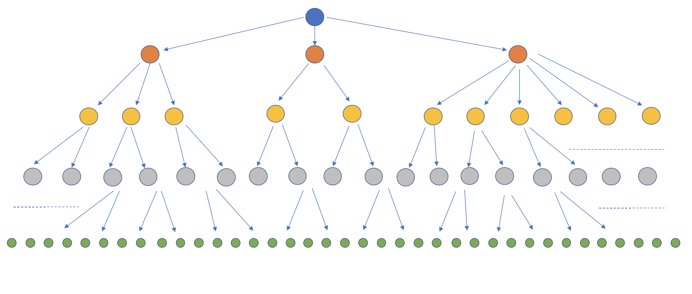
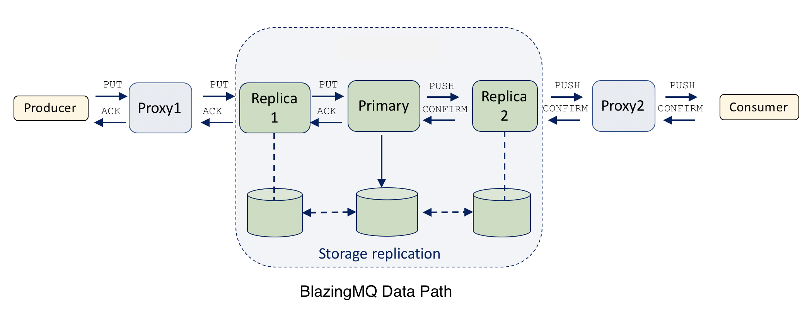

# High Availability in BlazingMQ
{: .no_toc }

* toc
{:toc}

## Summary

This article introduces readers to a high level design and implementation of
high availability in BlazingMQ. Readers are encouraged to read the *Network
Topology* [article](../network_topology) and also get familiar with various
[message routing patterns](../../features/message_routing_strategies) in
BlazingMQ before reading this article.

## Introduction

### BlazingMQ Network Topology

As described in the *Network Topology* [article](../network_topology) and shown
in the figure below, BlazingMQ builds a distribution tree for every queue.  The
tree is rooted at a queue's primary node.  Producer and consumer applications
are represented as leaf nodes.

This topology structure helps BlazingMQ achieve bandwidth savings in very high
fan-out ratio setups (a scenario where every message posted on the queue needs
to go to every consumer attached to that queue).

### What is High Availability

Failure is inevitable in any distributed system.  While total failure can be
minimized or even avoided in a well designed distributed system, partial
failures occur all the time as a result of misconfigurations, software bugs,
machine crashes, network or disk issues, etc.  Any formidable distributed
system must shield applications from such transient failures and allow them to
work seamlessly while healing itself in the background.

While there is no agreed upon definition for a "highly available" system, such
a system generally remains available for an extended period of time to its
users and minimizes downtime (both scheduled and unscheduled).  Often,
availability is expressed in
[*nines*](https://en.wikipedia.org/wiki/High_availability#%22Nines%22) and is
calculated as a percentage of time the system was functional from users'
perspective throughout a given year.  The more *nines* a system has, the more
available it is to the users.

---

## Clustering

In message queuing systems like BlazingMQ, high availability is achieved via
clustering and replication.  Every queue in BlazingMQ is stored on disk and
replicated across a group of machines such that the queue continues to be
accessible to applications in case some machines in the cluster become
unavailable.  Theoretically, as long as at least one machine in the cluster is
available, queue remains accessible.

In a BlazingMQ cluster, a node is dynamically assigned as primary for a queue
such that all writes to the queue go through that node.  Primary node also
ensures that queue is replicated to other nodes (replicas) in the cluster.  We
believe that there is already enough literature available on the topic of
clustering and replication and we won't go into more details about it in this
article.

While clustering and replication solve the problem of high availability to an
extent, BlazingMQ network topology provides an additional challenge.  As can be
seen in the distribution tree in figure above, failure of any node or link in
the tree directly affects BlazingMQ's availability to the applications.  The
higher the failing node in the tree, the higher the impact on BlazingMQ's
availability to users.  In fact, a node which is simply restarting also affects
BlazingMQ's availability.

The rest of the article documents BlazingMQ's data life cycle and approach to
seamlessly handle failing or restarting nodes in the distribution tree.

---

## Terminology

Before we go further, lets quickly go over some BlazingMQ terminology which
will be useful in the rest of the article.

- *PUT*: A message sent (or "posted") by the producer to the queue.

- *ACK*: An acknowledgement sent by BlazingMQ to the producer, informing
  whether the *PUT* message was successfully accepted or not.  BlazingMQ tries
  as much as possible to accept the *PUT* message and send successful *ACK*s.
  However there are scenarios where BlazingMQ may not accept *PUT* messages
  sent by a producer: the queue getting full, a long standing network issue,
  etc.  BlazingMQ guarantees is that producer will receive an *ACK* for every
  *PUT* message.

- *PUSH*: A message sent by BlazingMQ to the consumer.  This is effectively the
  same message as the corresponding *PUT*.

- *CONFIRM*: A message sent by the consumer to BlazingMQ indicating that it has
  processed a specific *PUSH* message.  Once a *CONFIRM* message is received,
  BlazingMQ is free to mark that message as deleted in the queue.

- *GUID*: A globally unique identifier assigned to every *PUT* message by
  BlazingMQ framework.  A *GUID* is used to identify a message throughout its
  lifetime, and as such, the *ACK* message sent to the producer by BlazingMQ
  contains the *GUID* that was assigned to the corresponding *PUT* message.
  Additionally, *PUSH* message sent by BlazingMQ to the consumer contains the
  *GUID* that was assigned to the corresponding *PUT* message, and lastly,
  *CONFIRM* message sent by consumer to BlazingMQ contains the same *GUID*.
  Each *GUID* is 16 bytes in length.

- *Upstream*: Direction from a BlazingMQ client application to queue's primary
  node.  *PUT* and *CONFIRM* messages always travel upstream.

- *Downstream*: Direction from a queue's primary node to a BlazingMQ client
  application.  *ACK* and *PUSH* messages always travel downstream.

---

## BlazingMQ Data Life Cycle

The figure above shows the path for various data messages in BlazingMQ.  *PUT*
and *CONFIRM* messages travel from client applications to primary node (i.e.,
upstream) while *ACK* and *PUSH* messages travel from primary node to client
applications (i.e., downstream).

Several things can go wrong in this data path:

- TCP connection(s) can drop due to network issues, missing heartbeats, etc.

- BlazingMQ nodes can crash.

- BlazingMQ nodes can undergo graceful shutdown or restart.

In the absence of any buffering and retransmission logic in BlazingMQ nodes,
any of the above conditions will lead to:

- Lost *PUT* messages and thus producers receiving an *ACK* message indicating
  failure.

- Lost *ACK* messages and thus producers not receiving any *ACK* messages for
  the *PUT* messages that they posted on the queue.

- Duplicate *PUT* messages being posted on the queue if a producer application
  sends the same *PUT* message again upon receiving a failed *ACK* message.

- Lost *CONFIRM* messages leading to duplicate *PUSH* messages to consumers.

Clearly, none of the above scenarios are acceptable.  Let's see in the
following sections how BlazingMQ handles these scenarios.

---

## High Availability in BlazingMQ

All problems listed in the previous section have been solved by introducing
these three principles in BlazingMQ nodes:

- Buffering and retransmission when node to the right is failing (see previous
  figure).

- Maintaining a history of message identifiers (*GUID*s) of the *PUT* messages
  posted on the queue.

- Introducing a shutdown sequence for nodes stopping gracefully.

Let's look into each of the above in detail.

### Buffering and Retransmission

Looking at the previous figure, one can see that in case of a failing node or
link, the node to the left of it is in the best position to buffer and retry
any messages until the failing node heals or a fail-over event occurs (i.e.,
left node connects to another healthy node on the right).

As an example, lets assume that replica 1 in the figure is failing.  One can
see that in such case, *PUT* messages sent by proxy 1 to replica 1 run the risk
of getting lost.  If such scenario occurs, producer application will forever
keep waiting for an *ACK* for its *PUT* message.  This is an extremely
unpleasant user experience, since BlazingMQ is not only failing to accept a
*PUT* message from the producer, but also failing to notify producer about it.

One way to solve this would be for proxy 1 to keep a list of *GUID*s of
unacknowledged *PUT*s.  If upstream node fails, explicitly send a failed *ACK*
for every *GUID* in the unacknowledged list.  This will ensure that producer
application now gets notified of BlazingMQ's failure to accept the *PUT*
message.  While this is an improvement, it is still not ideal as the producer
application now has to resend the *PUT* message (potentially several times).

A better way would be for proxy 1 to retransmit unacknowledged *PUT* messages
once replica 1 becomes healthy again, or when proxy 1 fails over to another
replica, whichever occurs first.  This approach will provide seamless user
experience for producer applications, and increase the chances of a successful
*ACK* instead of a failed *ACK*.

BlazingMQ adopts the following approach where every node along the path of a
*PUT* message from producer to primary node keeps an *in-memory retransmission
buffer* for *PUT* messages.  A new *PUT* message is buffered unconditionally,
is purged upon receiving an *ACK* message and retransmitted if a fail-over
event occurs.  This buffer is bound by both size and time, to ensure that a
BlazingMQ node's memory does not grow beyond the configured limit, and so that
producer applications can expect an *ACK* (success or failure) within the
configured time interval.

The presence of this retransmission buffer ensures that producer applications
don't see any transient issues in the BlazingMQ backend.  In fact, today the
entire BlazingMQ cluster (all replicas and primary node) can disappear from the
network for a few minutes, and producer applications won't notice any failure
from BlazingMQ APIs.  Now this's high availability!

On the *PUSH* message path, the replicated persistent storage acts as the
retransmission buffer, and as such, there is no need for a separate in-memory
retransmission buffer for *PUSH* messages.  Consider a scenario in the figure
where proxy 2 fails, leading to loss of in-flight *PUSH* messages.  In this
case, once a new path is established between replica 2 and the consumer,
replica 2 can simply use the replicated persistent storage to retrieve messages
that need to be sent to the consumer.

### History of *GUID*s

Readers may have noticed that if a node retransmits a *PUT* message after a
fail-over scenario, there is a risk of duplicate messages i.e., same message
could appear twice in the queue.  In above figure, this can occur if replica 1
failed right after forwarding a *PUT* message to the primary node.  Depending
upon the sequence of events, a primary node may or may not receive the message.
If it receives it, it will replicate and "commit" it in the queue.  However,
once proxy 1 fails over to another replica, it will retransmit this *PUT*
message, leading to the same message being posted twice on the queue.

BlazingMQ solves this problem by having the primary node maintain a history of
*GUID*s of *PUT* messages previously posted on the queue.  This history is
bound by a configurable time interval.  At a high level, history is represented
as a custom hash table where *GUID* is the key.  This logic ensures downstream
nodes can retransmit PUT messages without creating duplicates, thereby
providing a better user experience.

### Shutdown Sequence of Stopping Nodes

Nodes in BlazingMQ can undergo graceful shutdown or restart, and we want
BlazingMQ to provide a seamless user experience in this scenario as well.
Specifically, we don't want producer or consumer applications to notice any
failure when a node along the *PUT* or *PUSH* data paths is restarted or
shutting down.  Additionally, we want to ensure that the node shutting down
does not take any additional work and drains any pending work in a timely
manner.

Shutdown sequence is implemented with the help of pairs of
*StopRequest*/*StopResponse*.  A node which is shutting down informs its peer
nodes (both upstream and downstream) of this action by sending them
*StopRequest*.  Upon receiving a *StopRequest*, peer nodes stop sending any
*PUT* and *PUSH* messages to the node.  Peer nodes keep any new *PUT* messages
in the retransmission buffer (described above) and *PUSH* messages stay in the
replicated storage.  This ensures that the node shutting down does not get any
new work.  *ACK* and *CONFIRM* messages are still sent to the node by peers.
This is necessary to ensure that any pending *PUT* and *PUSH* messages no
longer remain pending and remaining work at the node shutting down is drained.

Lets walk through as example.  In above figure, if replica 1 is shutting down,
it will send *StopRequest*s to proxy 1 and primary nodes.  Upon receiving the
request, proxy 1 (the downstream node) will stop sending *PUT* messages and
keep them in retransmission buffer.  It will continue to forward *CONFIRM*
messages, if any, to the replica.  On the other side, the primary node will
stop sending *PUSH* messages to the replica (primary may send them along
another route, if applicable).  The primary node will, however, continue to
send *ACK* messages, which replica will forward to proxy 1.  After a while, all
*PUSH* messages which are pending (i.e., unconfirmed) along the route will be
confirmed by consumer(s), and at that time, all pending work will be drained.
At this time proxy 1 will send *StopResponse* to the replica and the link
between them will be considered 'frozen'.  In other words, once *StopResponse*
has been sent, no further communication will occur between the two nodes.

In the scenario shown in above figure, there is only one downstream (proxy 1)
and one upstream node (primary) for replica 1.  However, in practice, there can
be tens or hundreds of downstream and more than one upstream nodes for the node
shutting down.  In such case, there will be a *StopRequest*/*StopResponse* pair
for every such combination.

Peers are required to respond back with *StopResponse* within a configured time
interval.  The chosen time interval has interesting effect -- a low value may
not be enough to receive *CONFIRM* messages from consumers for all pending
*PUSH* messages (some consumers take several seconds or even minutes to process
and confirm messages, which is the whole point of a message queue!).  In such
scenario, those unconfirmed *PUSH* messages will be sent by primary node to
another consumer, if any, on a different route, and as such, the same *PUSH*
message could end up being processed twice by two different consumers in an
application ecosystem.  This is within contract, as BlazingMQ provides *at
least once* delivery guarantees.  On the other hand, choosing a higher time
interval for *StopResponse* will lead to delayed fail over and delayed delivery
of *ACK* and *PUSH* messages to producers and consumers respectively.  In
practice, the value of time interval varies for each BlazingMQ cluster, and is
chosen keeping in mind the latency requirements and typical *CONFIRM* times of
applications using that BlazingMQ cluster.

---

## Extending High Availability to Client Libraries

Readers may have noticed that the high availability support described above
ensures uninterrupted service to BlazingMQ users in cases when a replica or a
primary node fails or restarts, but not when a proxy node fails or restarts.
This is indeed a correct observation.  If currently if BlazingMQ proxy node
(i.e., the node immediately connected to the client) goes bad, producer
applications will receive failed *ACK*s messages.  Additionally, when such
producers attempt to post the same message again after conditions have
improved, the message may appear twice in the queue.  This is because the first
copy of the message, which was posted while the proxy node failed, may or may
not have reached the primary node.  Moreover, the second copy of the message
will be assigned a new *GUID* by the proxy (recall that *GUID*s are assigned by
the BlazingMQ node immediately connected to the client).

A simple solution for this is to update BlazingMQ client libraries to have the
same high availability logic that exists in BlazingMQ nodes.  And this is
exactly what has been done!  BlazingMQ C++ client library has been updated to
contain a retransmission buffer, generate *GUID*s and support
*StopRequest*/*StopResponse* work flow.  More details about it can be found in
[this](../high_availability_sdk) article.

---

## Conclusion

Addition of high availability support in BlazingMQ has undoubtedly improved
BlazingMQ user experience and has helped provide uninterrupted service to users
in case of transient issues in BlazingMQ backend, including network and
hardware.  Applications can rely on BlazingMQ to buffer and retry messages
seamlessly.  Additionally, BlazingMQ nodes can be restarted at any time without
service interruption, which helps BlazingMQ maintainers during software
upgrades, machine or network maintenance, etc.

---
