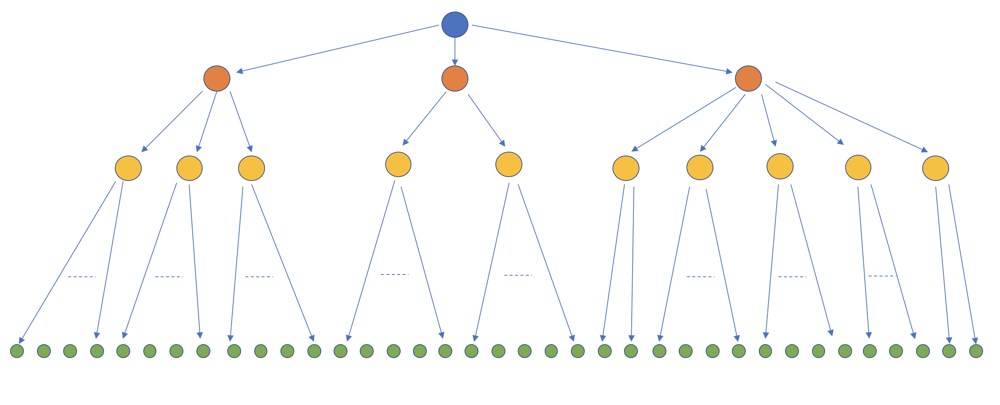

# BlazingMQ Network Topology
{: .no_toc }

* toc
{:toc}

## Introduction

This document introduces readers to BlazingMQ'sf network topology and describes
how its unique topology enables BlazingMQ to provide flexible deployments, high
bandwidth savings and very high fan-out ratio (10,000+ and beyond).

---

## Network Topology

As seen in the [*Clustering*](../clustering#clustering) section of another
article, a BlazingMQ setup can be deployed in a typical or an alternative
topology.

The above figure shows a typical deployment of BlazingMQ.  The four nodes in
the middle represent a BlazingMQ cluster.  The blue node in the cluster
represents a queue’s primary node, while the orange nodes represent
replicas.  Producer/consumer applications can connect to any node in the
BlazingMQ cluster instead of always requiring to connect to the primary node.

Above figure shows an alternate deployment of BlazingMQ.  As can be seen,
applications (green nodes) connect to local BlazingMQ agents (yellow nodes),
which then connect to any node in the BlazingMQ cluster.  These local BlazingMQ
agents are known as proxies and are optional in a BlazingMQ deployment.

An important conclusion can be made from above -- client applications don't
need to directly connect to a queue's primary, and there can be any number of
hops between an application and the primary node.  This leads to an interesting
design in BlazingMQ as discussed in the next section.

---

## Distribution Tree

There is another more generic way to redraw the above two figures for a given
queue:

In the above figure, blue node is queue's primary, orange nodes are the
replicas, yellow nodes are proxies and green nodes are client applications.  As
mentioned previously, the case of producers is simple, so we will assume that
all green nodes are consumer applications.

As can be seen from the figure, for every queue, BlazingMQ builds a
distribution tree rooted at queue's primary node, and as new links are
established or existing links are torn down due to nodes (primary, replica,
proxy, application) starting or stopping, BlazingMQ readjusts the routes in the
affected sub-tree as necessary.  This readjustment of routes occurs dynamically
-- every node at a given level attempts to establish a healthy connection with
at least one node from the upper level.

---

## Message Flow in the Distribution Tree

An interesting feature of the topology shown in the previous figure is that it
optimizes message flow for queues in fan-out and broadcast modes.  Consider
this setup:

In this figure, there are hundreds of consumers for a broadcast queue.  In the
absence of a distribution tree, all consumers would connect directly with the
primary node, which would then need to carry out the fan-out to all those
consumers by itself.  While this approach works up to a certain number of
consumers (as well as the traffic rate), it does not scale well.  After a
certain threshold, primary node's network gets saturated and/or consumers start
seeing higher latency.

In a distribution tree, however, the primary node (and in fact, every
intermediate node) carry out a fan-out to only a handful of nodes connected to
it from the lower level, thereby ensuring a message is disseminated to all
consumers in an efficient way.  This approach effectively implements
application level multicast (note that we are using the term 'multicast' in a
logical sense; all communication occurs over TCP).

This topology ensures that BlazingMQ can achieve very high (theoretically
infinite) fan-out ratio.  If at any time, we notice that the fan-out ratio is
putting pressure on bandwidth or latency for nodes in particular level (yellow
nodes), we can simply add another level of nodes (gray nodes) below the
affected level in the tree, thereby reducing the fan-out ratio at all nodes in
the affected level.

This tree-based topology has been very successful at Bloomberg for supporting
applications which demand very large number of consumers for a queue in fan-out
or broadcast mode.  BlazingMQ's topology provides tremendous bandwidth saving
in such scenarios, and also helps cut down the latency of message delivery to
consumers, as each node has to do minimal fan-out of a message.

This approach is used to run queues with over 6,000 consumers in some Bloomberg
production environments.

Another benefit of a tree based architecture is efficient fail-overs.  Imagine
a scenario where primary node crashes or goes down gracefully.  In the approach
where all producer and consumer applications are connecting directly to the
primary, they will now fail over to the new primary, and the new primary will
see a deluge of incoming connections and requests (thousands or more).  This
can slow down the fail over process and introduce undesirable latency for
applications.  In the case of BlazingMQ's tree based approach, fail overs are
very fast as only the affected sub-tree needs readjustment.  So in the scenario
where primary node crashes, the new primary receives fail over requests only
from the replica nodes and the nodes connected to it from one level below,
instead of thousands of requests from all producer and consumer applications.

A question that may arise in this setup is the effect of multi-hop architecture
on message latency.  Since a message has to travel through several hops,
additional latency is unavoidable.  In most set ups, BlazingMQ provides an end
to end median latency in single digit milliseconds.  Ultimately, it comes down
to carrying out end to end bench-marking in a production-like setup, reviewing
the latency and bandwidth numbers, and then adjusting number of consumers or
number of levels in the tree.

---

## Conclusion

The distribution tree based approach works very well for certain high fan-out
use cases.  While this approach comes at the cost of additional deployment
footprint, it makes up for that by leading to network bandwidth savings for
high traffic and high fan-out queues.

How BlazingMQ manages to prevent or minimize disruption in message flow for
applications in distribution tree like topology is an interesting topic.
Please see [this](../high_availability) article for details about BlazingMQ's
high availability design.

---
