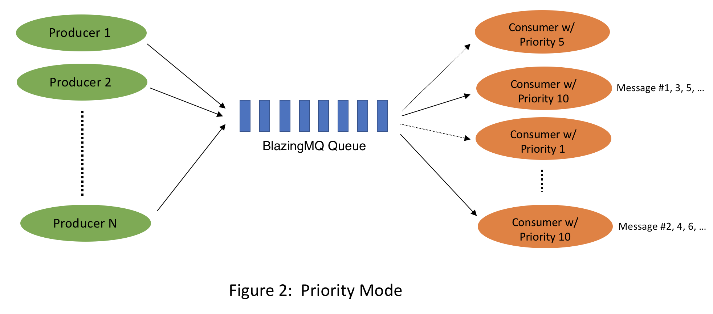

# Message Routing Patterns
{: .no_toc }

* toc
{:toc}

The most interesting aspect of BlazingMQ is the various ways in which it can
route messages to consumer applications attached to a queue.  Given a queue,
any number of producers and consumers can attach to it.  The case of multiple
producers is straightforward -- every producer can post messages to the queue.
It becomes more interesting when multiple consumers are attached to the same
queue -- BlazingMQ may decide to route a newly arrived message to:

- A specific consumer instance
- A subset of consumer instances
- All consumer instances

BlazingMQ may choose one or more consumer instances based on one or more of the
following attributes:

- A round-robin strategy
- Capacity and/or priority advertised by the consumer(s)
- Any criteria (filter) specified by the consumer(s)
- Routing strategy with which the queue is configured

Across all of the above, the most important aspect is the routing strategy of a
queue (also referred to as "queue mode" in some places in BlazingMQ).  Routing
strategy is something that is statically configured when the BlazingMQ domain
(application namespace) is registered with the BlazingMQ framework.

## Work Queue

In work queue mode, BlazingMQ routes messages arriving in the queue in a
round-robin fashion to the attached consumers, such that a message goes to only
one consumer.  This mode ensures that messages are load balanced across all
consumers.  BlazingMQ marks a message as deleted once the consumer confirms the
message.  In case a consumer goes away without confirming messages, BlazingMQ
reroutes those messages to other consumer instances, if there are any.  It
should be obvious that in work queue mode, the order of message processing by
the consumers can be different from the order of arrival of messages in the
queue.

An extremely attractive feature of this mode is that as a new consumer attaches
to the queue, BlazingMQ starts sending a subset of the messages to the new
consumer.  This means that applications can increase their processing capacity
by simply spinning up a new consumer instance, without making any code or
configuration changes or having to worry about creating additional queues.  No
consumer attached to the queue stays idle.  In theory, an application can watch
the queue's size, and decide to spin up new consumer instances if the queue is
growing, or wind down existing instances if the queue's size has gone below a
low watermark.

---

## Consumer Priority Mode

In this mode, consumers attaching to a queue can also declare their priorities,
and BlazingMQ routes messages *only* to the consumer with the highest priority.
If multiple consumers with the same highest priority exist, BlazingMQ routes
messages across those consumers in a round-robin fashion.  BlazingMQ marks a
message as deleted once the consumer confirms the message.  Readers may notice
that the work queue mode described above is just a simpler case of priority
mode where all consumers have same priority.  In fact, there is no separate
routing strategy called "work queue" in code or configuration, and BlazingMQ
back-end does not treat "work queue" as a special mode.

Consumer priorities give applications finer control over message processing, in
that applications can direct the traffic to a specific consumer instance or
machine as desired, by playing with consumers' priorities.

Additionally, consumers can dynamically update their priorities via an API
provided in the BlazingMQ SDK.  One way in which this feature can be leveraged
by applications is to have a primary/backup setup for their consumers, by
ensuring that one consumer has highest priority while other consumer instances
have a lower priority.  Additionally, in case applications have multiple such
queues, they can configure consumers' priorities such that primary consumers
for their queues are evenly spread across the application cluster, thereby
ensuring equal usage of resources.  Moreover, the ability to adjust consumer
priority dynamically also enables consumer applications to integrate well with
other patterns like leader election -- a consumer instance elected as a leader
can bump up its priority to a higher value, thereby ensuring that it is the
only one consuming from the queue.

---

## Fan-out Mode

In both work queue and priority modes, a message goes to only one consumer
instance.  However, there are use cases where each message posted on the queue
needs to go to all consumers attached to the queue.  This is where fan-out mode
comes into the picture.

In this mode, consumers identify themselves with a string identifier when
attaching to the queue (called *AppId* in BlazingMQ). *AppId*s are needed so
that BlazingMQ can uniquely identify consumers across restarts, and need to be
registered with the BlazingMQ framework upfront.  So for example, if users of a
BlazingMQ queue have registered five *AppId*s with BlazingMQ, they can bring up
five consumers, each using one of the *AppId*s, and each consumer will receive
every message posted on the queue.

Consumers in fan-out mode can consume from the queue at their own pace and can
also process and confirm messages in a different order.  Logically, one can
think of each *AppId* getting its own copy of the queue.  However, under the
hood, BlazingMQ maintains only one queue and thus, only one copy of the message
in the storage (of course, replication leads to *N* copies of the message,
where *N* is the replication factor).  Storing the message only once
irrespective of number of *AppId*s can lead to significant storage savings,
especially in the case of a high number of *AppId*s (i.e., having a high
fan-out ratio).

BlazingMQ marks a message as deleted once *all* consumers have confirmed the
message.

A powerful feature supported in fan-out mode is that multiple consumers can use
the same *AppId* and also specify priorities.  In such scenario, BlazingMQ
sends messages only to the consumer with the highest priority in *that* *AppId*
group.  If in an *AppId* group, multiple consumers with highest priority exist,
messages are routed in a round-robin fashion across them.  Thus, BlazingMQ
ensures that one consumer in each *AppId* group receives every message posted
on the queue.

Readers will notice that consumer priority mode is just a simpler case of
fan-out mode, where there is only one (default) *AppId*.

---

## Broadcast Mode

Broadcast mode is unique and significantly different from other queue modes
found in BlazingMQ and in other message queuing systems.  In this mode,
messages arriving on a queue are neither persisted on disk nor buffered in
memory.  Instead, they are immediately dispatched to the consumers attached to
the queue at that instant and then "dropped" by BlazingMQ.  BlazingMQ makes no
effort to keep messages for consumers which may arrive at a later time.  As a
consequence, broadcast mode provides an *at most once* delivery guarantee,
contrasting with the *at least once* delivery guarantee provided by all other
queue modes.  Additionally, consumers can specify a priority when attaching to
the queue, and BlazingMQ routes all messages to all consumers having highest
priority.

Apart from providing no persistence, another important way in which broadcast
mode differs from fan-out mode is that the number of consumers in broadcast
mode is dynamic.  In other words, new consumers can attach to the queue at any
time, and existing consumers can leave the queue any time without invoking any
special API or without registering new consumers or *AppId*s with the BlazingMQ
framework.

Broadcast mode can be useful for scenarios where occasional message loss is
acceptable for applications e.g., tick-type data stream, analytics, health
check notifications, cache invalidation notifications, or when applications
have other means to retry/recover lost messages.

Broadcast mode makes BlazingMQ a very attractive messaging system to users,
because along with the queue modes described above, BlazingMQ can provide them
with a mix of both *at most once* as well as *at least once* delivery
guarantees in their application ecosystems, and they don't need to pick any
another messaging system for their *at most once* delivery requirements.
Broadcast mode has exactly same set of APIs as other queue modes which means
applications don't have to treat broadcast mode as a special case.

---
