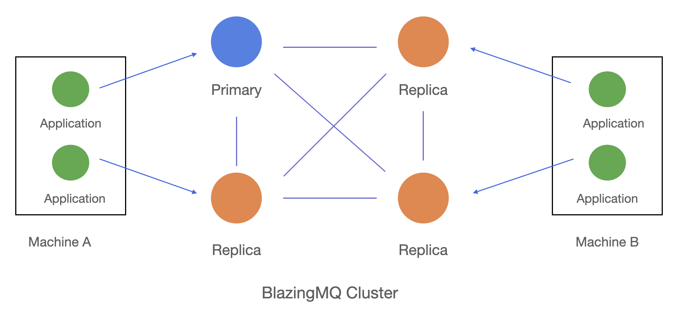

# Architecture Overview
{: .no_toc }

* toc
{:toc}

Here's a high-level overview of BlazingMQ's architecture,
including details like clustering, typical network topology, and some common
terminology.

For additional information on BlazingMQ's's architecture and internal design,
please see the [*Architecture*](../../../architecture) section.

## Introduction

BlazingMQ's infrastructure consists of message brokers and clients (producer and
consumer applications) running in a distributed environment. Clients don't
talk to each other directly -- they only connect to BlazingMQ brokers. Client libraries
are available in C++, Java, and Python.

In BlazingMQ, a queue represents a logical stream of data over which producer
and consumer applications exchange messages. Queues enable producers and
consumers to temporally and spatially isolate from one another, thereby ensuring
they are decoupled.

Queues are persisted on disk and replicated across machines in the BlazingMQ
cluster. Queues are grouped into domains: a domain provides a namespace for
applications and encapsulates common configuration associated with the queues,
like routing mode, the queue's storage quota, message TTL, and other parameters.
See also [*Concepts*](../concepts) for more details about BlazingMQ
domains.

BlazingMQ optionally supports the notion of tiers -- a queue can have multiple
isolated instances across different tiers, such as *dev*, *alpha*, *beta*, *uat*,
*qa*, *prod*, etc.

BlazingMQ provides the following guarantees for messages:

- **Guarantee of Delivery**

  - Any message posted by a producer application that is successfully accepted
    by BlazingMQ is guaranteed to be delivered to the consumer application(s) *at
    least once*. This means that consumers may receive duplicates in case of a
    software crash, hardware issues or network glitch. Note that a [*broadcast
    mode*](../../features/message_routing_strategies#broadcast-mode) routing
    strategy is an exception to this rule, since it provides *at most once* delivery
    guarantee by design.

  - Note that not all messages posted by a producer application are guaranteed
    to be successfully accepted by BlazingMQ. A message can be rejected by
    BlazingMQ due to reasons like a queue's storage quota limit being reached, a
    long-running network issue, etc. So, to rephrase the above bullet,
    BlazingMQ either reliably delivers the message to the consumer or reliably
    tells the producer that the message was not accepted.

- **Guarantee of Ordering**

  - Messages are delivered in the publishing order, unless the queue has
    multiple consumers attached to it, along with a configuration (static or
    dynamic) which allows multiple consumers to consume messages from the
    queue concurrently.

---

## Clustering

### Typical Deployment

The above figure shows the typical deployment of a BlazingMQ setup. The four nodes
in the middle represent a BlazingMQ cluster where queues are persisted and
replicated. The blue node represents the queue's primary node, which is in charge of
managing the queue (replication, message routing, etc.). Orange nodes
represent replicas which, as the name suggests, are in charge of storing a
local copy of the queue.

Producer/consumer applications can connect to any node in the BlazingMQ cluster
instead of always being required to connect to the primary node. If a client
application connects to a replica node, the replica will automatically make the
primary node aware of the client application, and all messages flowing to/from
the client application will go through the replica.

More details about BlazingMQ's clustering and alternative deployments can be
found [here](../../architecture/clustering), as well as in other entries in the
[*Architecture*](../../../architecture) section.

---

## Terminology

This section reviews some common terminology used in BlazingMQ. Additional
details about some of these concepts can be found [here](../concepts).

- *BlazingMQ Cluster*: A group of machines where queues are hosted. The
  typical size of a BlazingMQ cluster varies from 3-7 machines. Application
  tasks generally don't run on BlazingMQ cluster machines, unless the BlazingMQ
  cluster is co-located. Co-location can help achieve the lowest possible latency.

- *BlazingMQ Domain*: A namespace owned by an application using BlazingMQ. A
  domain encapsulates various configuration parameters like queue quota,
  message expiration time (TTL), queue mode (priority, fan-out, broadcast),
  consistency level (eventual or strong), etc. In addition, a domain can also
  capture the list of tiers. A domain is represented as `bmq://foo.bar.baz`.
  See [`bmqt::URI`](../../apidocs/cpp_apidocs/group__bmqt__uri.html) for more
  details.

- *Queue*: A queue represents a logical stream of data in BlazingMQ over which
  producer and consumer applications exchange messages. A queue enables
  producers and consumers to temporally and spatially isolate from one another,
  thereby ensuring that they are decoupled from each other. A queue is
  identified by a URI, which takes the form of `bmq://foo.bar.baz/myQueueName`
  where `bmq://foo.bar.baz` is the domain and `myQueueName` is the queue name.
  See [`bmqt::URI`](../../apidocs/cpp_apidocs/group__bmqt__uri.html) for more
  details.

- *Producer*: A BlazingMQ client application which sends ("posts") messages to
  a queue.

- *Consumer*: A BlazingMQ client application which receives ("consumes")
  messages from a queue. An application can be both the producer and consumer
  for the same or different queues.

- *BlazingMQ Broker*: A back-end application which is part of the BlazingMQ
  framework, and participates as a member of a BlazingMQ cluster. A broker can
  be either a primary or a replica for a queue hosted on that cluster.

- *BlazingMQ Proxy*: An *optional* back-end application which is part of the
  BlazingMQ framework, and runs on client machines. A proxy is not a member of
  a BlazingMQ cluster, but communicates with the cluster on behalf of client
  applications. It's the same executable as the BlazingMQ broker but with a
  different configuration. In fact, a BlazingMQ broker instance can act as a
  proxy for some queues and a cluster member for other queues, though such
  configurations are very rare.

- *Primary*: The node in a BlazingMQ cluster which is managing a queue. All
  writes for a queue go though its primary node. The primary node is also in charge
  of a queue's replication to other members in the cluster. At a given
  time, there can be only one primary mode for a given queue.

- *Replica*: A node in BlazingMQ cluster which holds a copy of the queue.
  Replicas cannot initiate a write operation on the queue, although they push
  new messages to consumer applications when requested to do so by the primary node.
  A replica can be promoted to a primary node if the existing primary node goes
  down. All nodes in a BlazingMQ cluster which are not the primary node for a queue
  act as its replicas.

- *Leader*: A node in a BlazingMQ cluster which is in charge of managing the
  BlazingMQ cluster, including things like cluster metadata, cluster
  membership, health of cluster nodes, list of partitions, list of all active
  queues, primary node(s), etc. A leader's goal is to ensure that every node
  in the cluster has up-to-date metadata information, so that the node can make
  the right decision. A node in a BlazingMQ cluster can act as both a leader and a primary.

- *PUT*: A message sent (or "posted") by the producer to the queue.

- *ACK*: An acknowledgement sent by BlazingMQ to the producer, informing the
  producer if the *PUT* message was successfully accepted or not. Note that
  the API to post a *PUT* message is asynchronous, and thus, an *ACK* message
  delivers the result to the producer. Also note that while BlazingMQ tries as
  much as possible to accept the *PUT* message and send successful *ACK*s,
  there are scenarios where a producer may receive a negative *ACK*, which
  indicates that *PUT* message could not be accepted by BlazingMQ. Reasons for
  a negative *ACK* could be the queue quota getting full, a long-standing
  network issue, etc. Note, what BlazingMQ guarantees is that the producer
  will receive an *ACK* for every *PUT* message.

- *PUSH*: A message sent by BlazingMQ to the consumer. This is effectively the
  same message as the corresponding *PUT*.

- *CONFIRM*: A message sent by the consumer to BlazingMQ indicating it has
  processed a specific *PUSH* message. Once a *CONFIRM* message is received,
  BlazingMQ is free to mark that message as deleted in the queue. Note that a
  consumer can send *CONFIRM* messages in any order. For example, if a
  consumer receives 5 *PUSH* messages, it can choose to send *CONFIRM*s for
  messages 2 and 4, and keep messages 1, 3 and 5 for later processing. This is
  a very powerful feature and this is what enables BlazingMQ to implement work
  queues, as well as for consumers to implement multi-threaded logic.

---
