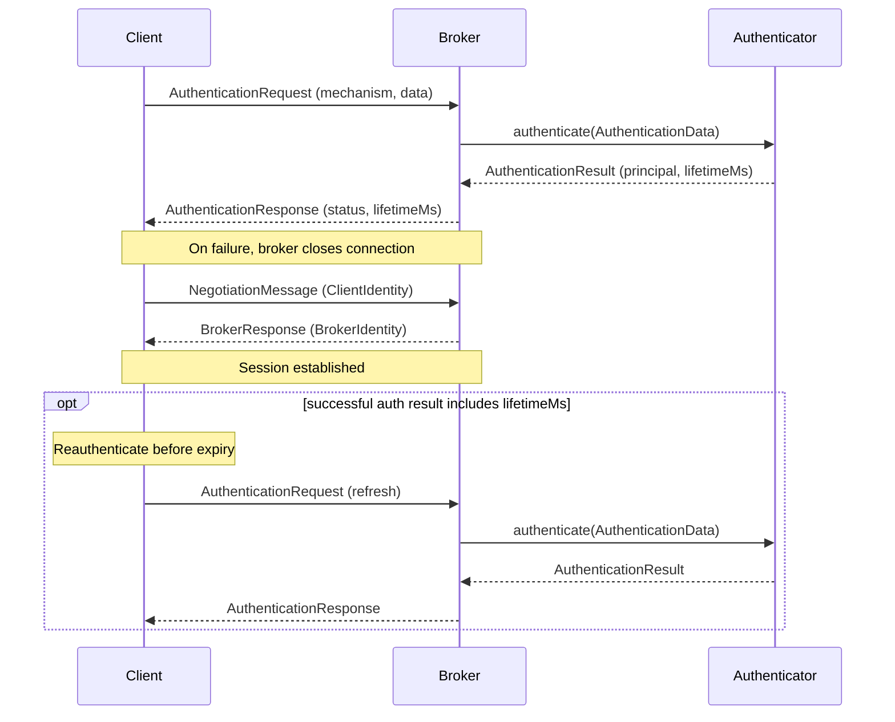

# Security
{: .no_toc }

* toc
{:toc}

## Introduction

BlazingMQ currently supports authentication. Support for authorization and TLS
is on our [Roadmap](../introduction/roadmap.md).

---

## Authentication

BlazingMQ authentication verifies the identity of clients when they connect.
Client SDKs also support automatic reauthentication for expiring credentials.

Key capabilities:

- **Pluggable authentication mechanisms** -- clients authenticate using a
  mechanism configured by the broker, such as `BASIC` or `JWT`.
- **Automatic reauthentication** -- when a credential lifetime is set, client
  SDKs automatically reauthenticate before the credential expires.
- **Configurable anonymous access** -- the broker can be configured to reject
  unauthenticated clients or accept them using a configured anonymous
  credential.
- **Non-blocking** -- the broker performs authentication work asynchronously
  on a dedicated thread pool.

{: .important }
> Authentication is not enforced by default.  Without explicit configuration,
> unauthenticated clients are accepted as anonymous.  To require credentials,
> configure an authenticator and set `anonymousCredential` to `disallow`
> (see [Configuration](#configuration)).

### Authenticators

Authentication in BlazingMQ is managed by the *authenticators* configured on
the broker.  Each authenticator implements a specific **mechanism** (e.g.
`BASIC`, `JWT`), and the set of authenticators configured on a broker
determines which mechanisms its clients may use to authenticate.

The broker provides a set of [built-in authenticators](#built-in-authenticators);
additional authenticators can be supplied through the broker's
[plugin mechanism](plugins.md).

### How Authentication Works in BlazingMQ

The following sequence shows the authentication and negotiation flow when a
client connects:



1. The client sends an **`AuthenticationRequest`** containing the mechanism
   name (e.g. `"BASIC"`) and credential data (mechanism-specific binary
   payload).

2. The broker looks up the **authenticator** registered for that mechanism and
   calls its `authenticate()` method in the authentication thread pool.

3. The authenticator returns an **`AuthenticationResult`** with a
   human-readable `principal` and an optional `lifetimeMs`.

4. The broker sends an **`AuthenticationResponse`** back to the client.  On
   success, session negotiation proceeds.  On failure, the broker closes the
   connection (see [Failure Handling](#failure-handling) below).

5. If `lifetimeMs` is present, the client SDK schedules reauthentication
  before the lifetime duration expires.

Clients that do not support authentication, or are not configured to
authenticate, are handled by the **anonymous credential** policy (see
[Configuration](#configuration) below).

#### Failure Handling

**Initial authentication failure.**  When credentials are rejected, the broker
closes the connection.  The SDK automatically reconnects and retries until it
succeeds or the configured session connect timeout elapses (see
`connectTimeout` in `SessionOptions`).

**Reauthentication failure.**  If reauthentication is rejected, or the client
does not reauthenticate before expiry, the broker closes the connection.  The
client SDK may then reconnect according to its normal retry behavior.

### Configuration

Authentication is configured in the broker configuration file
(`bmqbrkcfg.json`) under the `appConfig.authentication` key.

#### Schema overview

```json
{
  "appConfig": {
    "authentication": {
      "authenticators": [
        {
          "name": "<authenticator-name>",
          "settings": [
            { "key": "<key>", "value": { "stringVal": "<val>" } }
          ]
        }
      ],
      "anonymousCredential": { ... },
      "minThreads": 1,
      "maxThreads": 8
    }
  }
}
```

| Field | Description |
|-------|-------------|
| `authenticators` | List of authenticator configurations.  Each entry names an authenticator and provides its settings.  All configured authenticators must have unique mechanisms. |
| `anonymousCredential` | Controls what happens when a client does not authenticate.  See below. |
| `minThreads` | Minimum number of threads in the authentication thread pool (default: 1). |
| `maxThreads` | Maximum number of threads in the authentication thread pool (default: 8). |

#### Anonymous credential

`anonymousCredential` controls what the broker does with a client that connects
and negotiates a session "anonymously" without sending an
`AuthenticationRequest`.  It may be omitted, or set to one of two options:

| Setting | Effect |
|---------|--------|
| *omitted* | The broker implicitly adds the built-in `AnonAuthenticator` in addition to any configured authenticators, and authenticates these clients with mechanism `ANONYMOUS` and an empty identity.  They are accepted with the principal `"anonymous"`. |
| `"disallow": {}` | Reject unauthenticated clients.  Every client must authenticate explicitly. |
| `"credential": { "mechanism": "<m>", "identity": "<id>" }` | Authenticate anonymous clients as if they had sent an `AuthenticationRequest` with `<m>` and `<id>` (e.g. `"BASIC"` and `"alice:<password>"`).  Mechanism `<m>` must be a configured authentication mechanism or the broker will not start. |

{: .warning }
> Configuring an authenticator does **not** disable anonymous access.  A broker
> with `BasicAuthenticator` configured and `anonymousCredential` omitted still
> accepts unauthenticated clients as `"anonymous"`.  Set
> `"anonymousCredential": { "disallow": {} }` to require credentials.

{: .note }
> Listing `AnonAuthenticator` in `authenticators` while `anonymousCredential` is
> omitted is rejected at startup.  Configure `anonymousCredential` explicitly if
> you configure `AnonAuthenticator`.

#### Example: external plugin authenticator

```json
{
  "appConfig": {
    "plugins": {
      "libraries": ["/opt/bmq/plugins/"],
      "enabled": ["MyJwtAuthenticator"]
    },
    "authentication": {
      "authenticators": [
        {
          "name": "MyJwtAuthenticator",
          "settings": [
            { "key": "issuer", "value": { "stringVal": "https://auth.example.com" } },
            { "key": "audience", "value": { "stringVal": "blazingmq" } }
          ]
        }
      ],
      "anonymousCredential": { "disallow": {} }
    }
  }
}
```

This assumes a custom `MyJwtAuthenticator` plugin is installed under
`/opt/bmq/plugins/`.  See
[Plugins](plugins.md#writing-a-custom-authenticator-plugin) for how to write
one.

### Built-in Authenticators

BlazingMQ ships with two built-in authenticators.  They are part of the broker
task and do not require a plugin library.

#### AnonAuthenticator

{: .warning }
> `AnonAuthenticator` does not verify client identity and is not secure.  It is
> intended for development and testing only and is not suitable for production
> use.

| Property | Value |
|----------|-------|
| Name | `AnonAuthenticator` |
| Mechanism | `ANONYMOUS` |
| Credential format | N/A (the credential payload is ignored) |
| Session lifetime | None (no reauthentication) |

`AnonAuthenticator` ignores the credential and returns the principal
`"anonymous"`.  The broker adds it automatically when `anonymousCredential` is
omitted, or when no authenticators are configured at all.

It takes one optional setting, `shouldPass` (a `boolVal`, default `true`).
Setting it to `false` makes the authenticator reject every request, which is
useful for testing.

#### BasicAuthenticator

{: .warning }
> `BasicAuthenticator` does not encrypt credentials.  It is not suitable for
> insecure environments and should only be used over connections protected by
> TLS.

| Property | Value |
|----------|-------|
| Name | `BasicAuthenticator` |
| Mechanism | `BASIC` |
| Credential format | `username:password` (UTF-8 bytes) |
| Session lifetime | 600 seconds (10 minutes), then reauthentication is required |

Settings are key-value pairs where the key is the username and the value is the
password (as a `stringVal`).

{: .note }
> The colon character (`:`) is not allowed in usernames but is accepted in
> passwords.  The authenticator splits the credential payload on the **first**
> colon.

To write or deploy a custom authenticator plugin, see
[Plugins](plugins.md#writing-a-custom-authenticator-plugin).

### Client-Side Integration

All client SDKs use the same authentication model. An application registers a
credential callback that the SDK invokes whenever it needs credentials to
authenticate a connection. This includes the initial connection, any subsequent
reconnection, and credential renewal before the current credentials expire.

If no credential callback is registered, the SDK connects without
authentication.

The following examples use a `BASIC` credential for demonstration and assume
the broker is configured with a matching `BasicAuthenticator` username and
password.

#### C++ SDK

Clients provide the credential callback through `bmqt::SessionOptions`.  The
callback takes no arguments and returns a `bsl::optional<AuthnCredential>`
containing the authentication mechanism and credential data, or
`bsl::nullopt` on failure.

```cpp
#include <bmqt_sessionoptions.h>
#include <bmqt_authncredential.h>

bmqt::SessionOptions options;

// Set the authentication credential callback
options.setAuthnCredentialCb([]() {
    bsl::string data = "alice:<password>";
    return bsl::optional<bmqt::AuthnCredential>(
        bsl::in_place,
        "BASIC",
        bsl::vector<char>(data.begin(), data.end()));
});

bmqa::Session session(options);
session.start();
```

#### Java SDK

Clients provide an `AuthnCredentialCb` through `SessionOptions`.  The callback
takes no arguments and returns an `AuthnCredential`, or throws on failure.

```java
import com.bloomberg.bmq.AuthnCredential;
import com.bloomberg.bmq.SessionOptions;

AuthnCredential credential =
    AuthnCredential.builder().setMechanism("BASIC").setData(data).build();

SessionOptions options =
    SessionOptions.builder().setAuthnCredentialCb(() -> credential).build();
```

#### Python SDK

Authentication support in the Python SDK is not yet available.

---
