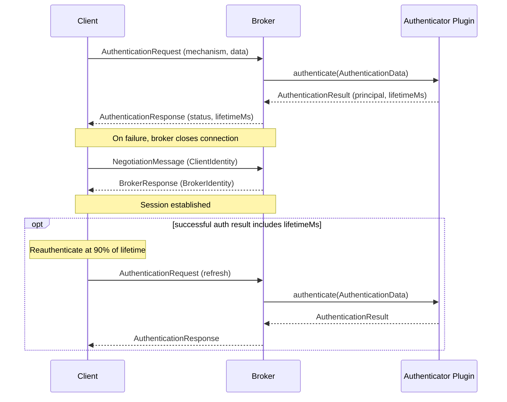

# Security
{: .no_toc }

* toc
{:toc}

## Introduction

This document describes the security features in BlazingMQ for controlling
access to the system.

BlazingMQ currently supports authentication. Support for authorization and TLS
is on our [Roadmap](../introduction/roadmap.md).

---

## Authentication

BlazingMQ authentication verifies client identity before session negotiation.
Initial authentication runs at connection time, and client SDKs can
automatically reauthenticate based on credential lifetime, including short-lived
tokens.

Key capabilities:

- **Pluggable mechanisms** -- clients authenticate using a broker-configured
  mechanism (e.g. `BASIC`, `JWT`).
- **Automatic reauthentication** -- when credential lifetime is set, client
  SDKs reauthenticate automatically before expiry.
- **Configurable anonymous access** -- unauthenticated clients can be rejected
  or mapped to a configured default mechanism and identity.
- **Non-blocking** -- broker authentication runs asynchronously on a dedicated
  thread pool and does not block other clients.

{: .important }
> Authentication is not enforced by default.  Without explicit configuration,
> unauthenticated clients are accepted as anonymous.  To require credentials,
> configure an authenticator and set `anonymousCredential` to `disallow`
> (see [Configuration](#configuration)).

### How Authentication Works in BlazingMQ

The following sequence shows the authentication and negotiation flow when a
client connects and provides credentials:



1. The client sends an **`AuthenticationRequest`** containing the mechanism
   name (e.g. `"BASIC"`) and credential data (mechanism-specific binary
   payload).

2. The broker looks up the **authenticator plugin** registered for that
   mechanism and calls its `authenticate()` method in the authentication thread
   pool.

3. The plugin returns an **`AuthenticationResult`** with a human-readable
   `principal` and an optional `lifetimeMs`.

4. The broker sends an **`AuthenticationResponse`** back to the client.  On
   success, session negotiation proceeds.  On failure, the broker closes the
   connection (see [Failure Handling](#failure-handling) below).

5. If `lifetimeMs` is present, the client SDK schedules reauthentication at
  **90 % of the lifetime** so authentication is renewed before expiry.

Clients that do not support authentication, or are not configured to
authenticate, are handled by the **anonymous credential** policy (see
[Configuration](#configuration) below).

#### Failure Handling

**Initial authentication failure.**  When credentials are rejected, the broker
closes the connection.  The SDK automatically reconnects and retries until it
succeeds or the configured session connect timeout elapses (see
`connectTimeout` in `SessionOptions`).

**Reauthentication failure.**  The broker closes the connection if a
reauthentication attempt is rejected or if the client does not reauthenticate
before its credential expires.  The SDK reconnects and retries as above.

### Configuration

Authentication is configured in the broker configuration file
(`bmqbrkcfg.json`) under the `appConfig.authentication` key.

#### Schema overview

```json
{
  "appConfig": {
    "authentication": {
      "authenticators": [
        {
          "name": "<plugin-name>",
          "settings": [
            { "key": "<key>", "value": { "stringVal": "<val>" } }
          ]
        }
      ],
      "anonymousCredential": { ... },
      "minThreads": 1,
      "maxThreads": 8
    }
  }
}
```

| Field | Description |
|-------|-------------|
| `authenticators` | List of authenticator plugin configurations.  Each entry names a plugin and provides its settings.  All plugins must have unique mechanisms. |
| `anonymousCredential` | Controls what happens when a client does not authenticate.  See below. |
| `minThreads` | Minimum number of threads in the authentication thread pool (default: 1). |
| `maxThreads` | Maximum number of threads in the authentication thread pool (default: 8). |

#### Anonymous credential

The `anonymousCredential` field is a choice between two options:

| Option | Effect |
|--------|--------|
| `"disallow": {}` | Reject all unauthenticated clients.  Every client **must** authenticate. |
| `"credential": { "mechanism": "<m>", "identity": "<id>" }` | Authenticate unauthenticated clients using the given mechanism and identity.  The broker forwards the identity to the matching authenticator plugin as if the client had sent it. |

When `anonymousCredential` is **omitted entirely**, the built-in
`AnonAuthenticator` is used and all unauthenticated connections are accepted
with the principal `"anonymous"`.

#### Example: Basic authenticator with two users

```json
{
  "appConfig": {
    "authentication": {
      "authenticators": [
        {
          "name": "BasicAuthenticator",
          "settings": [
            { "key": "alice", "value": { "stringVal": "<password>" } },
            { "key": "bob",   "value": { "stringVal": "<password>" } }
          ]
        }
      ],
      "anonymousCredential": { "disallow": {} }
    }
  }
}
```

This configuration:

- Enables the built-in `BasicAuthenticator` with credentials for `alice` and
  `bob`.
- Disallows anonymous connections -- every client must authenticate with a
  valid username and password.

#### Example: external plugin authenticator

```json
{
  "appConfig": {
    "plugins": {
      "libraries": ["/opt/bmq/plugins/"],
      "enabled": ["MyJwtAuthenticator"]
    },
    "authentication": {
      "authenticators": [
        {
          "name": "MyJwtAuthenticator",
          "settings": [
            { "key": "issuer", "value": { "stringVal": "https://auth.example.com" } },
            { "key": "audience", "value": { "stringVal": "blazingmq" } }
          ]
        }
      ],
      "anonymousCredential": { "disallow": {} }
    }
  }
}
```

This assumes a custom `MyJwtAuthenticator` plugin is installed under
`/opt/bmq/plugins/`.  See
[Plugins](plugins.md#writing-a-custom-authenticator-plugin) for how to write
one.

### Built-in Authenticators

BlazingMQ ships with two built-in authenticator plugins.

#### AnonAuthenticator

| Property | Value |
|----------|-------|
| Plugin name | `AnonAuthenticator` |
| Mechanism | `ANONYMOUS` |
| Credential format | N/A |
| Session lifetime | None (no reauthentication) |

`AnonAuthenticator` always succeeds, returning the principal `"anonymous"`.
It is the default authenticator when `anonymousCredential` is not configured.

#### BasicAuthenticator

| Property | Value |
|----------|-------|
| Plugin name | `BasicAuthenticator` |
| Mechanism | `BASIC` |
| Credential format | `username:password` (UTF-8 bytes) |
| Session lifetime | 600 seconds (10 minutes), then reauthentication is required |

Settings are key-value pairs where the key is the username and the value is the
password (as a `stringVal`).

{: .note }
> The colon character (`:`) is not allowed in usernames but is accepted in
> passwords.  The authenticator splits the credential payload on the **first**
> colon.

To write or deploy a custom authenticator plugin, see
[Plugins](plugins.md#writing-a-custom-authenticator-plugin).

### Client-Side Integration

All client SDKs use the same authentication model. An application registers a
credential callback that the SDK invokes whenever it needs credentials to
authenticate a connection. This includes the initial connection, any subsequent
reconnection, and credential renewal before the current credentials expire.

If no credential callback is registered, the SDK connects without
authentication.

#### C++ SDK

Clients provide the credential callback through `bmqt::SessionOptions`.  The
callback takes no arguments and returns a `bsl::optional<AuthnCredential>`
containing the authentication mechanism and credential data, or
`bsl::nullopt` on failure.

```cpp
#include <bmqt_sessionoptions.h>
#include <bmqt_authncredential.h>

bmqt::SessionOptions options;

// Set the authentication credential callback
options.setAuthnCredentialCb([]() {
    bsl::string data = "alice:<password>";
    return bsl::optional<bmqt::AuthnCredential>(
        bsl::in_place,
        "BASIC",
        bsl::vector<char>(data.begin(), data.end()));
});

bmqa::Session session(options);
session.start();
```

#### Java SDK

Clients provide an `AuthnCredentialCb` through `SessionOptions`.  The callback
takes no arguments and returns an `AuthnCredential`, or throws on failure.

```java
import com.bloomberg.bmq.AuthnCredential;
import com.bloomberg.bmq.SessionOptions;

AuthnCredential credential =
    AuthnCredential.builder().setMechanism("BASIC").setData(data).build();

SessionOptions options =
    SessionOptions.builder().setAuthnCredentialCb(() -> credential).build();
```

#### Python SDK

Authentication support in the Python SDK is not yet available.

---
